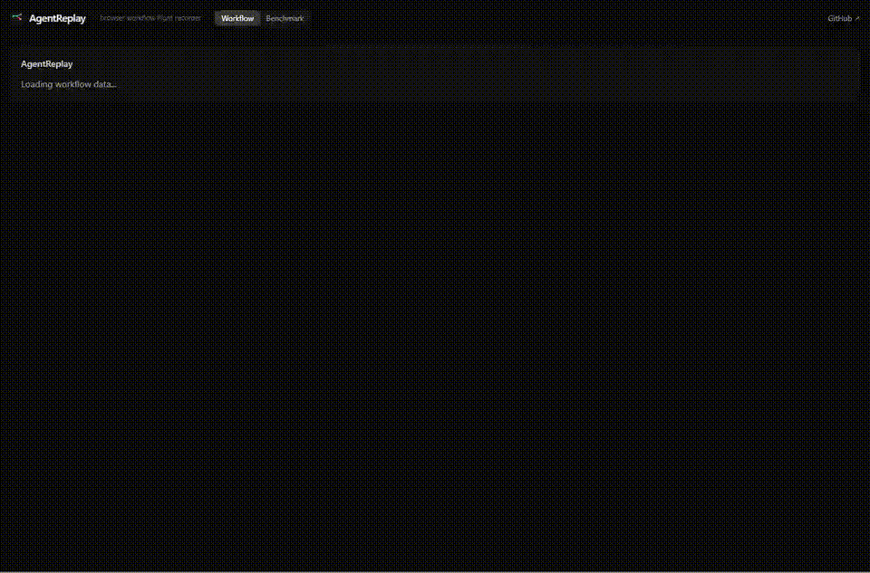

<div align="center">

# AgentReplay

### Browser workflow replay and failure analysis for agent testing

**Record a real web workflow once -> compile it into a replayable simulator -> run an agent against it -> see exactly where it diverged.**

**Status: early prototype (v0.x).**

[](https://github.com/Zwc-11/agentreplay/actions/workflows/ci.yml)
[](LICENSE)
[](CONTRIBUTING.md)


[Architecture](docs/architecture.md) | [Event Schema](docs/event-schema.md) | [Workflow Graph](docs/workflow-graph.md) | [Evaluation](docs/evaluation.md) | [Deployment](docs/deployment.md) | [DeepSeek](docs/deepseek.md) | [Roadmap](PLAN.md)

</div>

---



_[bundled demo data] Real dashboard capture from a local run of the bundled calendar demo. The GIF shows the human-vs-agent graph and first divergence step for `examples/demo-calendar/recordings/event.json`._

## Quickstart

The dashboard works without a backend by loading bundled demo data and falling back to demo mode automatically.

```bash
npm install
npm run dev -w @agentreplay/web
```

Open:

```text
http://localhost:3000
```

Prefer the terminal? Run the whole pipeline:

```bash
cd apps/api
pip install -e ".[dev]"
python -m app.scripts.demo
```

Optional full-stack Docker path (requires Docker Desktop or another Docker engine running):

```bash
docker compose -f infra/docker-compose.yml up
```

Run `make help` to see common development commands.

## What Is AgentReplay?

AgentReplay is an open-source browser workflow simulator and failure-analysis platform. It records a human performing a browser workflow, including clicks, typed input, navigations, and DOM snapshots. For network evidence, it captures network calls made via fetch (XHR is not intercepted). It then turns that recording into a structured workflow graph and a Playwright test scaffold.

You can run a browser agent against the same task and compare the human path to the agent path. The dashboard shows the first divergence step, step-level metrics, timeline evidence, network state, root-cause summary, and an exportable Playwright test scaffold.

The product loop is:

```text
Record workflow -> compile graph -> run agent -> compare paths -> explain failure -> export Playwright test scaffold
```

## Supported Target Scope

The supported targets today are the bundled demo sites and recordings in `examples/demo-shop`, `examples/demo-crm`, and `examples/demo-calendar`. Real public sites with drifting DOMs, changing network behavior, authentication flows, or anti-automation controls are out of scope for this v0.x prototype.

## Why Browser Agents Fail

Browser agents fail in ways that are hard to diagnose from a transcript alone:

- They click the wrong element, such as an ad, lookalike button, or stale selector.
- They act on stale DOM state before a route finishes loading.
- A network failure disables the intended control, then the agent retries the wrong action.
- They diverge silently several steps before the visible failure.

AgentReplay reconstructs the browser state at every step and renders the divergence as a graph so the root cause is clear quickly.

## Architecture

```text
Demo Website / User Browser
  -> Recorder SDK / Playwright
  -> Ingestion API
  -> Event Store
  -> Workflow Compiler
  -> Agent Runner + Evaluator
  -> React Dashboard
```

The backend uses event sourcing and a hexagonal architecture. Core logic lives in `core/`; infrastructure adapters live behind `adapters/`. This keeps the compiler and evaluator testable without a web server or database.

Stack:

- Web: React, TypeScript, Tailwind, React Flow, Framer Motion
- API: FastAPI, Playwright
- Storage: PostgreSQL, Redis, filesystem/object storage adapters
- Tooling: Docker Compose, Playwright, pytest, Vitest

## Repository Layout

```text
agentreplay/
  apps/
    web/                  React dashboard
    api/                  FastAPI ingestion, compiler, runner, evaluator
  packages/
    recorder-sdk/         Browser recorder -> BrowserEvent stream
    playwright-generator/ Workflow graph -> Playwright test scaffold
    graph-core/           Events -> states -> workflow graph
    eval-core/            Divergence detection and metrics
    shared-types/         Shared TypeScript contracts
  infra/                  Docker Compose
  examples/               Demo shop, CRM, and calendar workflows
  docs/                   Architecture and implementation docs
  tests/                  End-to-end tests
```

## Real Recording Import

Start the API and dashboard:

```bash
# terminal 1
cd apps/api
pip install -e ".[dev]"
python -m uvicorn app.main:app --reload --port 8000

# terminal 2, from repo root
npm install
npm run dev -w @agentreplay/web
```

Open `http://localhost:3000`, click **Import Recording**, and choose:

```text
examples/demo-calendar/recordings/event.json
```

The API endpoint is also available directly:

```bash
curl -X POST http://localhost:8000/v1/recordings:import \
  -H "content-type: application/json" \
  --data-binary @examples/demo-calendar/recordings/event.json
```

See [docs/real-recordings.md](docs/real-recordings.md) for SDK usage and import details.

## Demo Workflow

1. Record a checkout flow on the bundled demo shop.
2. AgentReplay compiles the event stream into a workflow graph.
3. Run one of the built-in drivers or the LLM driver against the task.
4. Inspect the human and agent paths in the graph.
5. Export a Playwright test scaffold or open a pre-filled GitHub issue from the failure summary.

## Event Schema

Recordings are stored as structured browser events:

```ts
type BrowserEvent = {
  sessionId: string;
  stepIndex: number;
  timestamp: string;
  eventType: "click" | "input" | "navigation" | "network" | "assertion" | "error";
  url: string;
  target?: {
    selector: string;
    role?: string;
    label?: string;
    text?: string;
    bbox?: { x: number; y: number; width: number; height: number };
  };
  network?: { method: string; path: string; status: number; latencyMs: number };
  screenshotKey?: string;
  domSnapshotKey?: string;
};
```

Network events mean the recorder captures network calls made via fetch (XHR is not intercepted). On replay, recorded network events seed the evaluation, but live network observations from a driver override the recording before metrics and summaries are computed; see `run_agent` in [apps/api/app/services/pipeline.py](apps/api/app/services/pipeline.py).

Full schema: [docs/event-schema.md](docs/event-schema.md).

## Generated Playwright Tests

AgentReplay exports Playwright test scaffolds from recorded human-path commands. In this v0.x prototype, generated tests may need target-app setup such as an initial page URL, route mapping, or fixtures before they run standalone. Verification artifacts for the calendar export are in [artifacts/generated-calendar-demo.spec.ts](artifacts/generated-calendar-demo.spec.ts) and [artifacts/verification-generated-calendar-demo-playwright-rerun.log](artifacts/verification-generated-calendar-demo-playwright-rerun.log).

[bundled demo data] Calendar export scaffold:

```ts
test("recorded workflow", async ({ page }) => {
  await page.getByRole("button", { name: "New event" }).click();
  await page.getByRole("textbox", { name: "Event title" }).click();
  await page.getByRole("textbox", { name: "Event title" }).fill("Design review");
  await page.getByRole("textbox", { name: "Start time" }).click();
  await page.getByRole("textbox", { name: "Start time" }).fill("14:00");
  await page.getByRole("button", { name: "Save event" }).click();
  await expect(page.getByText("Event saved")).toBeVisible();
});
```

## Evaluation Metrics

AgentReplay reports measurable, step-level outcomes for every run:

| Metric | What it tells you |
| --- | --- |
| Task success rate | Did the agent reach the goal state? |
| Step accuracy | Fraction of steps matching the human path |
| First divergence step | Where the agent first went off-route |
| Wrong-click count | Off-path actions taken |
| Agent recovery rate | How often it recovered after diverging |
| Network-caused failure rate | Failures rooted in a bad network response |
| Replay reconstruction success | Could the workflow be fully rebuilt? |
| Generated test pass rate | Do the exported Playwright tests pass? |

Definitions: [docs/evaluation.md](docs/evaluation.md).

## Benchmark

Run:

```bash
python -m app.scripts.benchmark
```

You can also use `GET /v1/benchmark` or the **Benchmark** tab in the dashboard.

[bundled demo data] Bundled demo benchmark across 4 workflows and 3 drivers. Provenance: `python -m app.scripts.benchmark`, captured in [artifacts/verification-api-benchmark.log](artifacts/verification-api-benchmark.log).

| Driver | Task success | Mean step accuracy | Wrong clicks | Mean first divergence | Network-caused |
| --- | --- | --- | --- | --- | --- |
| scripted | 100% | 100% | 0 | - | 0 |
| divergent | 0% | 63% | 4 | step 6.75 | 1 |
| random | 0% | 47% | 4 | step 4.75 | 1 |

The scripted driver is the always-correct baseline. The divergent and random drivers are deliberate failure drivers. Use `driver=llm` to benchmark the DeepSeek thinking model.

## Contributing

Contributions are welcome: bug reports, docs, demo workflows, and features. See [CONTRIBUTING.md](CONTRIBUTING.md), [CODE_OF_CONDUCT.md](CODE_OF_CONDUCT.md), and [SECURITY.md](SECURITY.md). Notable changes are tracked in [CHANGELOG.md](CHANGELOG.md).

## License

[MIT](LICENSE)
